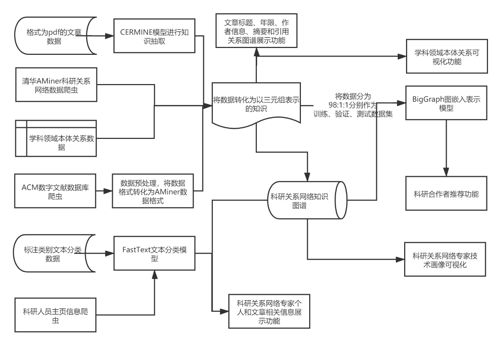
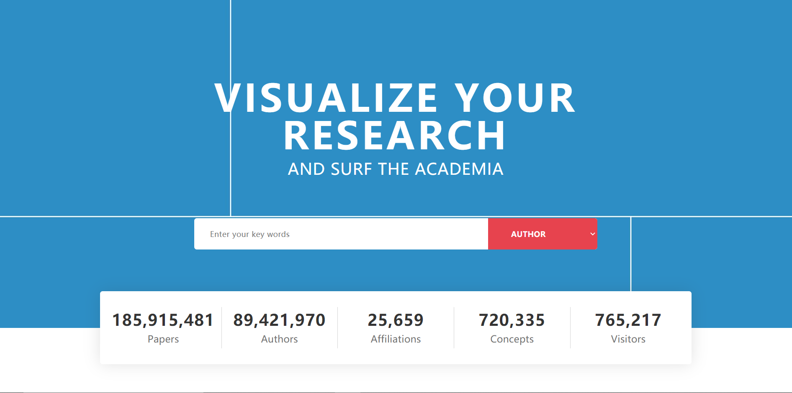
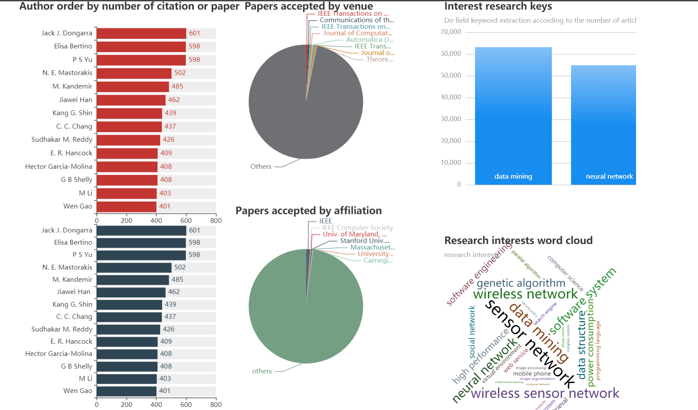
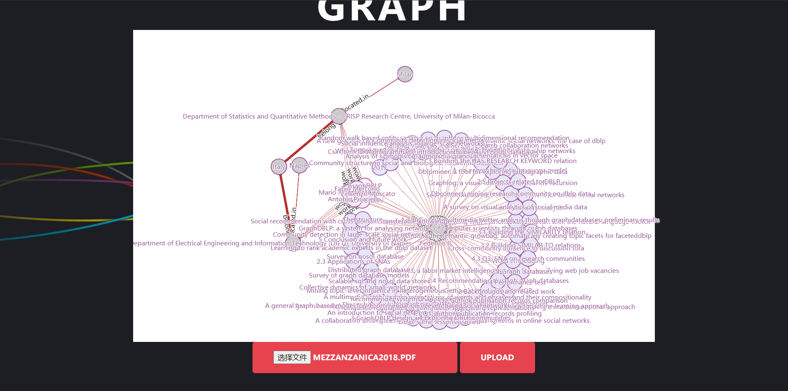
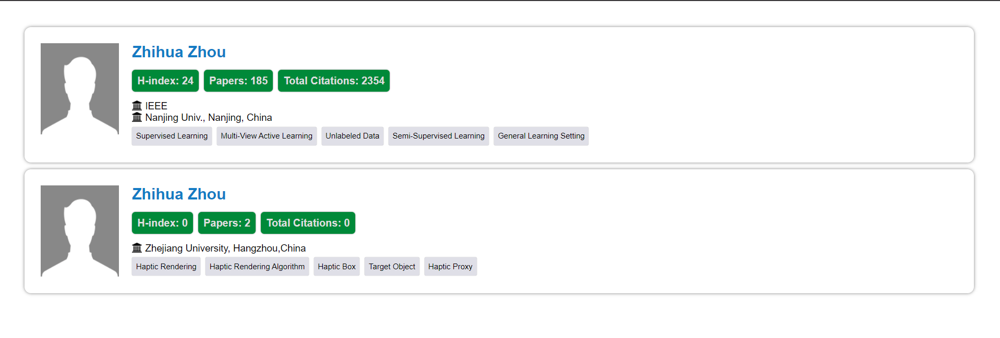
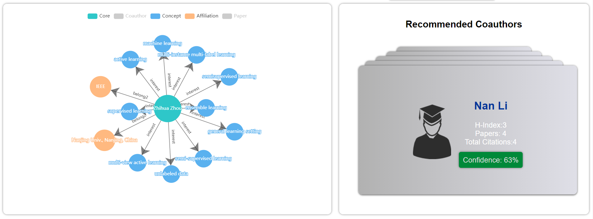
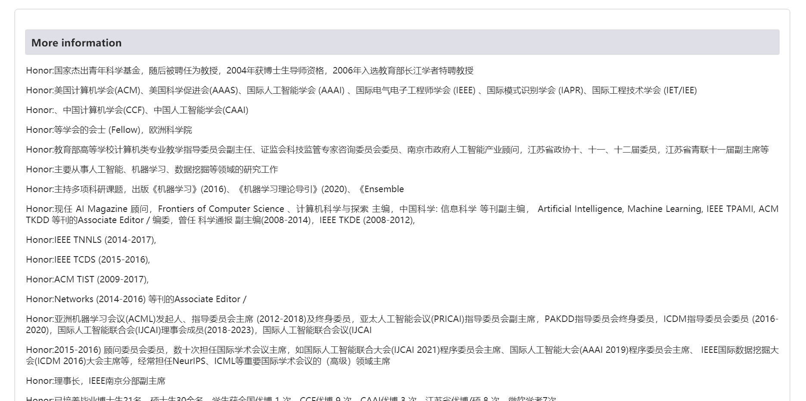
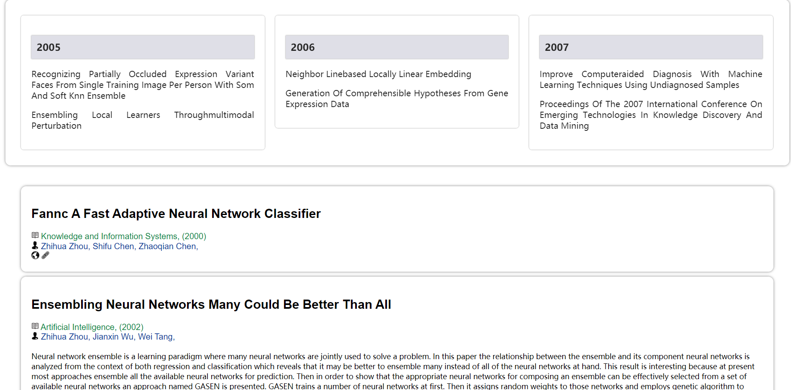

# 基于知识图谱的科研关系网络分析

[](https://github.com/lelandyan/ResearchRelationshipNetwork_KnowledgeGraph) [](https://www.python.org/downloads/release/python-360/) []() []()  []() []() []() [](https://github.com/lelandyan/ResearchRelationshipNetwork_KnowledgeGraph/issues)   

> 本项目完成了构建科研关系网络知识图谱以及相关应用。构建知识图谱所用到数据均来自网络爬虫爬行的数据；并且可提取结构化、半结构化、非结构化数据的实体与实体之间的关系；数据的存储采用的开源图数据库 Neo4j 存储科研网络关系知识；本文同时使用 Django 、 Echart.js 、D3.js和Boostrap 实现一个具有信息检索、大数据分析、专家技术画像可视化和合作专家信息以及推荐功能网站，可以快速的了解相关领域和专家的相关信息 。

## 总体技术路线：



## 项目功能模块以及相关效果图

* 主页面：

  

  

  主页面主要分为两个部分：

  第一部分为提供的搜索接口（可以支持作者名字搜索（拼音、汉字、英文）、研究领域搜（英文）、关键技术搜索（英文））

  第二部分为数据可视化分析，主要是分析数据库现存的数据，从左到右依次为，作者按照文章发表的数据和文章被引用的数据降序可视化，文章所属机构和投递的期刊会议所占比例问题，右侧是针对科研领域所发的文章数量降序排列展示，最后是一个词语，用于展示那些科研领域是比较热门（根据的是文章发表的数量）

* 副页面

  

  

  副页面主要分为两个部分：

  第一部分为可视化学科领域本体关系，就是展示不同领域的归属问题

  第二部分为通过上传的pdf文章来进行关系提取，并展示各个三元组之间的关系

* 搜索后跳转页面：

  

  这里会列出搜索字段相关的作者列表，然后显示各个作者相关的基本信息

* 点击选择某作者后生成的专家技术画像

  

  

  

  

  本页面共分为8个部分：

  第一个部分是关于作者的相关信息和数据库收录的文章数量

  第二个部分是关于该作者发表过论文的领域

  第三个部分是该作者合作过的作者名称和合作的多少

  第四个部分是关于该作者用图数据库查询后得到与之相关的感兴趣领域、合作者、作者所属结构和发表的文章

  第五个部分是关于该作者推荐合作功能，推荐以后可能合作的作者对象以及可信度和作者相关信息

  第六个部分是关于作者信息补充，通过网络爬虫获得作者信息，并使用文本分类模型进行分类并展示

  第七个部分是作者的在不同年份的发布的文章，显示文章的名字

  第八个部分是作者发表文章的详细展示，展示数据库中文章的详细信息。

## 项目介绍

本项目希望提出一种分析科研关系网络的新方法，能够充分利用现在的 数据挖掘、文本主题提取 、文本聚类分析等计算机技术 。这种方法应该 建立 起“领域 —专家 ”模型 ，通过技术关键词能够直接找到擅长该项技术的 专家 ，并能够完整地了解每个 专家 的擅长技术、工作单位、国籍等详细信息 。并采用系统分析方法 可以建立起不同专家之间的合作网络， 尤其是一些跨学科，跨领域的合作关系，从而更好地了解目前的交叉学科现状 。最后能够 建立一个具有检索和数据分析功能的 科研关系网站，实现相关的数据展示 。

| 课题要求                                                     | 是否完成  |
| :----------------------------------------------------------- | :-------: |
| 确定所分析的具体学科---计算机                                | :ok_hand: |
| 在文献数据库中通过网络爬虫获得数据                           | :ok_hand: |
| 通过文本主题提取、文本聚类分析挖掘关键技术                   | :ok_hand: |
| 通过技术作者等关键词查找擅长该技术的专家                     | :ok_hand: |
| 对搜索的专家进行挖掘，给出专家技术画像                       | :ok_hand: |
| 构建知识图谱，将领域-专家模型可视化，并提供可视化图表        | :ok_hand: |
| 建立不同专家的合作网络，可以推荐合作专家，更好了解交叉学科现状 | :ok_hand: |
| 建立一个具有检索和数据分析的科研关系网站                     | :ok_hand: |
| 实现相关数据的处理和数据展示                                 | :ok_hand: |

| 相关解释文档                                                 |                       详细解释跳转链接                       |
| :----------------------------------------------------------- | :----------------------------------------------------------: |
| 网络爬虫技术分析介绍                                         | [:thumbsup:](https://github.com/LelandYan/ResearchRelationshipNetwork_KnowledgeGraph/blob/main/doc/%E7%BD%91%E7%BB%9C%E7%88%AC%E8%99%AB%E6%8A%80%E6%9C%AF%E5%88%86%E6%9E%90.md) |
| BigGraph实体嵌入向量表示模型以及计算实体、实体关系相似度进行推荐功能 | [:thumbsup:](https://github.com/LelandYan/ResearchRelationshipNetwork_KnowledgeGraph/blob/main/doc/BigGraph%E5%B5%8C%E5%85%A5%E5%90%91%E9%87%8F%E7%9B%B8%E4%BC%BC%E7%AD%89.md) |
| Fasttext文本分类模型以及动态爬取专家文本信息分类功能         | [:thumbsup:](https://github.com/LelandYan/ResearchRelationshipNetwork_KnowledgeGraph/blob/main/doc/Fasttext%E6%96%87%E6%9C%AC%E5%88%86%E7%B1%BB%E6%A8%A1%E5%9E%8B.md) |
| 实体关系抽取模型以及针对结构化、半结构化和非结构化数据实体关系抽取功能 | [:thumbsup:](https://github.com/LelandYan/ResearchRelationshipNetwork_KnowledgeGraph/blob/main/doc/%E5%AE%9E%E4%BD%93%E5%85%B3%E7%B3%BB%E6%8A%BD%E5%8F%96%E6%A8%A1%E5%9E%8B%E4%BB%8B%E7%BB%8D.md) |
| 搜索框容错性和分词以及关键词搜索原理                         | [:thumbsup:](https://github.com/LelandYan/ResearchRelationshipNetwork_KnowledgeGraph/blob/main/doc/%E5%85%B3%E9%94%AE%E8%AF%8D%E6%90%9C%E7%B4%A2%E7%9A%84%E5%AE%B9%E9%94%99%E6%80%A7%E5%92%8C%E5%88%86%E8%AF%8D%EF%BC%88%E5%81%8F%E5%90%91%E4%BA%8E%E5%8E%9F%E7%90%86%EF%BC%89.md) |
| 不同类型关键词搜索原理                                       | [:thumbsup:](https://github.com/LelandYan/ResearchRelationshipNetwork_KnowledgeGraph/blob/main/doc/%E4%B8%8D%E5%90%8C%E7%B1%BB%E5%9E%8B%E5%85%B3%E9%94%AE%E8%AF%8D%E6%90%9C%E7%B4%A2%E7%9F%A5%E8%AF%86.md) |
| 搜索框检索关键词功能                                         | [:thumbsup:](https://github.com/LelandYan/ResearchRelationshipNetwork_KnowledgeGraph/blob/main/doc/%E6%90%9C%E7%B4%A2%E6%A1%86%E6%A3%80%E7%B4%A2%E5%8A%9F%E8%83%BD%EF%BC%88%E6%B5%81%E7%A8%8B%E5%9B%BE%EF%BC%89.md) |
| 图数据库介绍（Neo4j）                                        | [:thumbsup:](https://github.com/LelandYan/ResearchRelationshipNetwork_KnowledgeGraph/blob/main/doc/%E5%9B%BE%E6%95%B0%E6%8D%AE%E5%BA%93neo4j.md) |
| 文献数据库爬虫以及在线作者个人信息爬虫数据获取功能           | [:thumbsup:](https://github.com/LelandYan/ResearchRelationshipNetwork_KnowledgeGraph/blob/main/doc/%E6%95%B0%E6%8D%AE%E8%8E%B7%E5%8F%96%E6%96%B9%E6%A1%88.md) |
| 在线爬取专家个人信息文本数据分类功能                         | [:thumbsup:](https://github.com/LelandYan/ResearchRelationshipNetwork_KnowledgeGraph/blob/main/doc/%E4%BD%9C%E8%80%85%E4%B8%AA%E4%BA%BA%E4%BF%A1%E6%81%AF%E6%96%87%E6%9C%AC%E5%88%86%E7%B1%BB%E6%96%B9%E6%B3%95%EF%BC%88%E7%BC%96%E5%86%99%E5%85%B7%E4%BD%93%E7%9A%84%E6%96%B9%E6%B3%95%E7%BB%86%E8%8A%82%E5%92%8C%E5%8F%82%E6%95%B0%EF%BC%89.md) |
| 知识获取和实体关系抽取详细介绍                               | [:thumbsup:](https://github.com/LelandYan/ResearchRelationshipNetwork_KnowledgeGraph/blob/main/doc/%E7%9F%A5%E8%AF%86%E8%8E%B7%E5%8F%96%E5%92%8C%E5%AE%9E%E4%BD%93%E5%85%B3%E7%B3%BB%E6%8A%BD%E5%8F%96.md) |
| 知识入库详细介绍                                             | [:thumbsup:](https://github.com/LelandYan/ResearchRelationshipNetwork_KnowledgeGraph/blob/main/doc/%E7%9F%A5%E8%AF%86%E5%85%A5%E5%BA%93.md) |
| 学科领域本体关系数据与可视化功能                             | [:thumbsup:](https://github.com/LelandYan/ResearchRelationshipNetwork_KnowledgeGraph/blob/main/doc/%E5%AD%A6%E7%A7%91%E9%A2%86%E5%9F%9F%E6%9C%AC%E4%BD%93%E5%85%B3%E7%B3%BB%E6%95%B0%E6%8D%AE%E4%B8%8E%E5%8F%AF%E8%A7%86%E5%8C%96.md) |
| TD-IDF模型分析关键词介绍                                     | [:thumbsup:](https://github.com/LelandYan/ResearchRelationshipNetwork_KnowledgeGraph/blob/main/doc/TD-IDF%E5%88%86%E6%9E%90%E5%85%B3%E9%94%AE%E8%AF%8D.md) |
| 技术关键词提取以及可视化功能                                 | [:thumbsup:](https://github.com/LelandYan/ResearchRelationshipNetwork_KnowledgeGraph/blob/main/doc/%E6%8A%80%E6%9C%AF%E5%85%B3%E9%94%AE%E8%AF%8D%E6%8F%90%E5%8F%96%E4%BB%A5%E5%8F%8A%E5%8F%AF%E8%A7%86%E5%8C%96.md) |
| 专家技术画像以及专家模型可视化合作专家推荐功能               | [:thumbsup:](https://github.com/LelandYan/ResearchRelationshipNetwork_KnowledgeGraph/blob/main/doc/%E4%B8%93%E5%AE%B6%E6%8A%80%E6%9C%AF%E7%94%BB%E5%83%8F%E4%BB%A5%E5%8F%8A%E4%B8%93%E5%AE%B6%E6%A8%A1%E5%9E%8B%E5%8F%AF%E8%A7%86%E5%8C%96%E5%90%88%E4%BD%9C%E4%B8%93%E5%AE%B6%E6%8E%A8%E8%8D%90%20.md) |

## 项目目录结构

```python
├─AcaFinder
├─Model
├─toolkit
│  ├─embedding
│  ├─fasttextModel
│  ├─paper2kg
│  │  ├─output
│  │  └─toolkit
│  │      ├─Ollie
│  │      └─pdf_parser
│  │          ├─backends
│  │          └─jar
│  └─profileSpider
│      ├─ff_classifier
│      └─output
└─web
    ├─migrations
    ├─static
    │  ├─css
    │  │  └─sass
    │  │      ├─core
    │  │      │  └─mixins
    │  │      └─ui
    │  │          ├─components
    │  │          └─sections
    │  ├─data
    │  ├─images
    │  ├─js
    │  └─templates
    └─templates
```

## 可复用资源

#### 1.爬行并整合后科研关系网络RDF三元组数据

| 文件名称                 | 图数据结构类型 | 名称            | 数量（个） |
| ------------------------ | -------------- | --------------- | ---------- |
| e_author.csv             | 实体           | 作者            | 1712432    |
| e_affiliation.csv        | 实体           | 作者隶属机构    | 624750     |
| e_concept.csv            | 实体           | 研究领域        | 4055686    |
| e_paper.csv              | 实体           | 论文            | 2092355    |
| e_venue.csv              | 实体           | 期刊会议名      | 264389     |
| r_author2affiliation.csv | 关系           | 作者-机构       | 1287287    |
| r_author2concept.csv     | 关系           | 作者-研究领域   | 14589981   |
| r_author2paper.csv       | 关系           | 作者-论文       | 5192998    |
| r_citation.csv           | 关系           | 引用            | 8024873    |
| r_coauthor.csv           | 关系           | 合作者          | 4258946    |
| r_paper2venue            | 关系           | 论文-期刊会议名 | 2092355    |

#### 2.整理后的科研关系网络RDF三元组数据训练的图嵌入向量数据

| 文件名称              | 数据含义                               |
| --------------------- | -------------------------------------- |
| entity_embeddings.tsv | 实体和实体之间关系训练得到的图嵌入向量 |

#### 3.爬行并整合的学科领域本体关系数据

| 文件名称                             | 数据作用                                                     |
| ------------------------------------ | ------------------------------------------------------------ |
| sm_journal_classification_106_1.xlsm | 学科领域种类（ Domain_English、Field_English）和子领域（SubField_English）等数据 |
| aca-node.csv                         | 对不同的学科领域分配标签，存储节点权值与名称                 |
| aca-relation.csv                     | 针对不同节点，表示其关系网络                                 |
| academia.gexf                        | 使用Gexf第三方转化库 来将我们提取的 csv文件进行转化为 Gexf文件以便我们后期使用 echart.js进行渲染 |

#### 4.爬行并整合的ACM文献数据库数据

文献数据库的数据：数据集地址： https://dl.acm.org/action/doSearch?key+words
该数据的内容包括论文信息，包括了文章的标题、作者、发表时间、发表会议期刊名称、属于领域、文章所属DOI、文章摘要和引用的数量。 

| 文件名称     | 数据数量（条） |
| ------------ | -------------- |
| acm_data.csv | 11011          |

## 项目配置

#### 0. 本项目运行所需要机器配置以及各种语言类库

该项目主要是基于python编写，其中应用到了java、cypher、javascrpt、Django和jQuery语言等，需要运行在内存为16GB以上的电脑上。本项目是在win10系统下进行编写。

* 首先安装一系列pip依赖，这里提供了anaconda环境和pip下的requirement.txt以供选择。

## 项目不足

## 参考

[Agriculture_KnowledgeGraph](https://github.com/qq547276542/Agriculture_KnowledgeGraph)、[KGQA-Based-On-medicine](https://github.com/YeYzheng/KGQA-Based-On-medicine)、[KGQA_HLM](https://github.com/chizhu/KGQA_HLM)、[neo4j-prediction](https://github.com/mr-csj/neo4j-prediction)、[economic_audit_knowledge_graph](https://github.com/Guanngxu/economic_audit_knowledge_graph)、[ stock-knowledge-graph](https://github.com/lemonhu/stock-knowledge-graph)、[ DouBanRecommend](https://github.com/mattzheng/DouBanRecommend)、[Film-Recommendation-System](https://github.com/zut-cs-wangluo152/Film-Recommendation-System)、[ Taiwan-Stock-Knowledge-Graph](https://github.com/jojowither/Taiwan-Stock-Knowledge-Graph)、[AcaFinder](https://github.com/xyjigsaw/AcaFinder)

