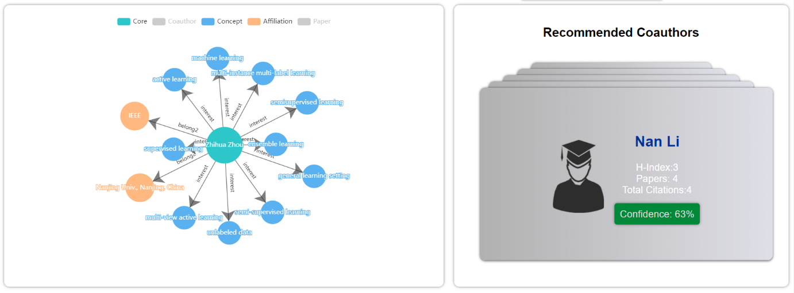
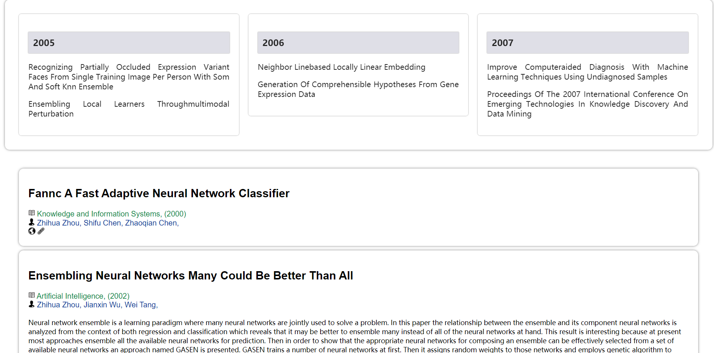

当用户选中某个作者的时候，本网站会根据图数据库中的关于作者的信息和我们通过作者个人主页爬行的数据进行展示。本页面共分为八个部分，下面我们分别详细的介绍八个模块，例如搜索周志华出现如下图4.17所示：

                               

 

 

 

###### 图4.17 专家画像

第一个部分是关于作者的相关信息和数据库收录的文章数量展示。关于作者的相关信息的展示，我们查询neo4j数据库中有关做的信息，包括作者的名称、作者的H-index值、作者发表文章的数量和作者发表文章被引用的数量。针对作者的发表文章的数量，我们按年份进行分组展示，使用echar.js动态的渲染数据，条形图横坐标表示年份，纵坐标表示的是文章的数量，实现与用户的交互功能。

第二个部分是关于该作者发表过论文的领域，也可以理解为作者感兴趣的领域，通过饼状图展示10个作者的感兴趣的领域，这里对于作者对哪个领域的更感兴趣没有显示，这里我们假设作者对我们展示的领域都是一样的感兴趣。同时饼状图展示的作者感兴趣的领域，可以在网站的主页通过study field字段类型进行进一步的搜索，从而可以得到更多研究该领域的作者以及该作者的相关的信息。

第三个部分是该作者合作过的作者名称，这里也是通过饼状图展示我们的数据库中的结果。我们这里判断是否是合作者的标准是，该作者发表的论文后署名的作者，也就是除了发表文章的第一作者后的其他作者，当然合作者会因为发表论文的多少而展示不同，我们设置了合作者数量的最大值30，不能显示超过30个合作者的名称。这里我们可以通过了解该作者的合作者的多少来了解该作者的发表论文的多少以及可以通过了解合作者的研究领域从而可以判断该作者的进一步的研究领域。

第四个部分是关于该作者用图数据库查询后得到与之相关的感兴趣领域、合作者、作者所属结构和发表的文章，这里我们使用echart.js绘制可以与用户交互的知识图谱图像。通过选择上方的标签决定是否展示该类型的节点。这个节点可以网络的形式展示该作者的感性却的领域、合作者、作者所属结构和发表的文章。并实现可以动态的拖拽，自动的放缩功能。

第五个部分是关于该作者推荐合作功能，推荐以后可能合作的作者对象以及可信度和作者相关信息。这里使用的是facebook开源的biggraph知识图谱实体嵌入向量表示模型，我们通过将知识图谱中实体（作者、文章、领域、期刊会议名称和学校名称）和实体之间的关系（属于、引用、合作、作者感兴趣领域、作者属于的结构、文章投递期刊等）进行嵌入向量表示训练，我们这里采用的TransE模型，本质思想是满足向量的加法。然后我们可以通过两个向量的余弦值的大小来判断两个向量的相似度。查找于该作者实体表示的向量相似度最高的5个作者并进行展示，这里我们可以通过作者的名称获取到作者对应的H-index值、发表的文章数量、发表文章被引用的数量和可信度，这个可信度其实就是我们计算机的余弦值的大小。

模型具体细节（模型训练的数据、命令和参数）

使用云服务器，内存124G CPU Inter(R)Xeon(R)CPU e5-2678 v3 @ 2.50GHz

为了验证PBG对学者数据嵌入的有效性，本文将原始数据 8761078实体和35449345关系按照98:1:1的比例划分训练集，测试集和验证集，传入PBG后进行训练验证。

  pip install torchbiggraph  torchbiggraph_import_from_tsv --lhs-col=0  --rel-col=1 --rhs-col=2 fb15k_config_cpu.py data/train.txt data/valid.txt  data/test.txt  torchbiggraph_train fb15k_config_cpu.py -p  edge_paths=data/FB15k/freebase_mtr100_mte100-train_partitioned  torchbiggraph_eval fb15k_config_cpu.py -p  edge_paths=data/FB15k/freebase_mtr100_mte100-test_partitioned -p  relations.0.all_negs=true -p num_uniform_negs=0  torchbiggraph_export_to_tsv fb15k_config_cpu.py  --entities-output entity_embeddings.tsv --relation-types-output  relation_types_parameters.tsv  

 

模型参数如下：

  num_epoch=20 #训练代数  num_uniform_negs=500 #规范负样本个数  num_batch_negs=500 #批训练负样本个数  batch_size=10000 #批训练大小  loss_fn=softmax #损失激活函数  lr=0.1#学习率  num_partitions=1 #分区个数  dimension=50 #嵌入维度  operator=TransE #嵌入方法，  

模型测试结果：

  MRRMean=0.71 #Reciprocal Rank 搜索评价  AUCArea= 0.95 #Under Curve, ROC曲线下面积  

 

推荐合作者，找到实体作者对应的嵌入向量，使用cos余弦的值选取与作者最为相似的5个作者，并展示。

第六个部分是关于作者信息补充，通过网络爬虫获得作者信息，并使用文本分类模型进行分类并展示。这里通过爬行作者的个人主页的信息，通过正则和python的BeautifulSoup解析库解析去除冗余无关的标签和获得相应的作者的电子邮箱的地址，对分词后的文本数据使用文本分类模型进行判断，可以得到文本的类型，这里文本的类型一共有三种：获得荣誉（honor）、教育职位（edu）、出版（publication），最后More information模块中将会出现该作者的电子邮箱地址、获得荣誉、教育职位和近期出版东西。

第七个部分是作者的在不同年份的发布的文章，显示文章的名字，这里相对第一个模块来说，这里显示不再是简单的统计数量，而是显示出该作者在某一年中发表的论文的题目，这里的具体实现是通过展示每年的两篇文章的标题，然后动态的展示每年的文章标题。通过这个模块，使用者可以快速的了解搜索作者每年发表文章的具体领域和技术，以便后期可以继续的追踪感兴趣的作者。

第八个部分是该作者发表文章的详细展示，展示数据库中文章的详细信息。对于该作者发表过的所有的文章，都会进行显示其标题、投递的会议名称或则期刊、发表的作者以及合作者名称和摘要。该模块将会完整显示数据库中关于该作者的文章的详细的信息，如果数据库没有相关的信息，将不会进行显示。